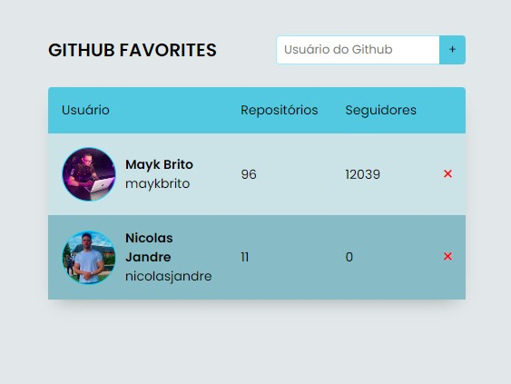

<h1 align="center">Github Favorites</h1>

Lista de favoritos do GitHub utilizando a API do Github e LocalStorage para manter os adicionados.

 

Tecnologias utilizadas:
 HTML e CSS
 JavaScript
 Git e GitHub

